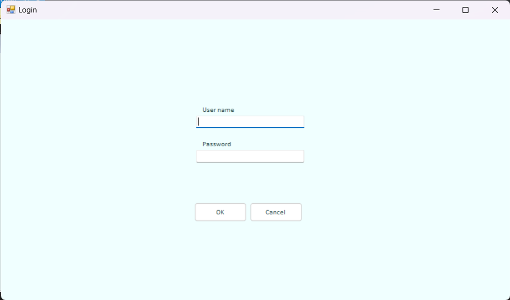

# EDP_BookIn

Welcome. This repository consists BookIn, an information management system for a bookshop. It runs on VB.Net and MySQL.

Its current functionalities are the basic CRUD of records in the database and additionally allows import and export of csv files.

## To run the app:
1. Clone the repository. 
2. Open MySQL Workbench and go to Data Import. Select "Import from self-contained file" and choose BookInDumpAct5.sql from the repo.
3. Open visual studio and click "Open a project or solution." Select the "BookIn_WFANet1.sln" inside the BookIn_WFANet1 folder.
4. Click start.
5. Login with credentials username and password "menchie"

## Screenshots:

### Login screen

### Home screen

### Book screen

### Order and order line screen

### Customer screen

### Admin screen
